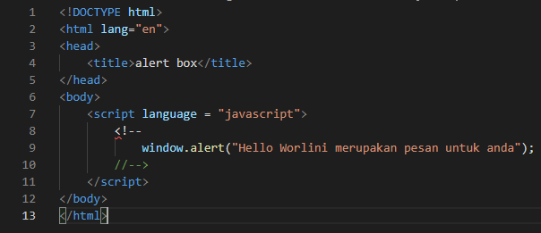

# Lab5Web
| Nama      | Lydia Diffani Siregar |
| ----------- | ----------- |
| NIM     | 312010498       |
| Kelas   | TI.20.A.1        |

## Langkah langkah praktikum 5

1. Pertama - tama membuka VSC

2. Kemudian membuat dokumen HTML dengan nama file <strong> lab4_box.html </strong>

Ini hasil di Microsoft Edge nya

3. <strong> Javascrip Dasar </strong>

 Pemakaian Alert sebagai property window. 

Ini hasil di Microsoft Edge nya

4. Pemakaian method dalam objek

Ini hasil di Microsoft Edge nya

5. Pemakaian Prompt

Ini hasil di Microsoft Edge nya
