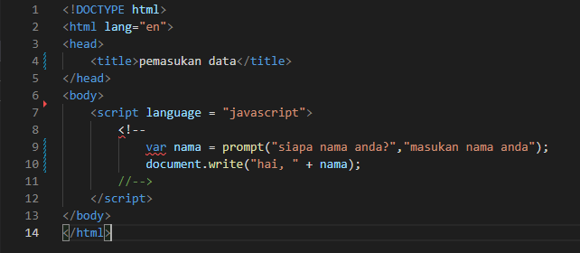
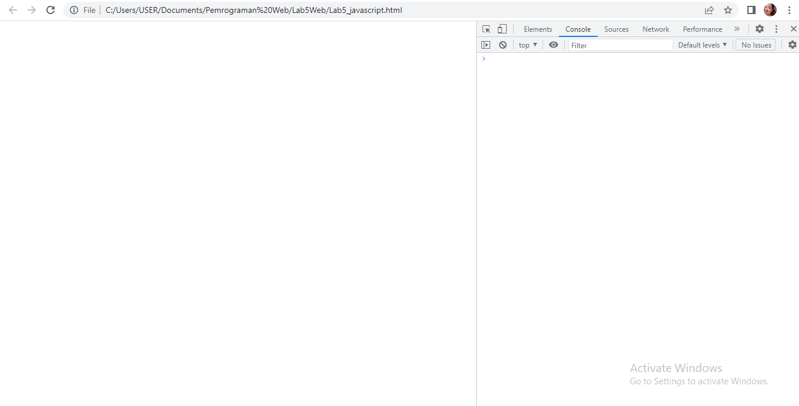
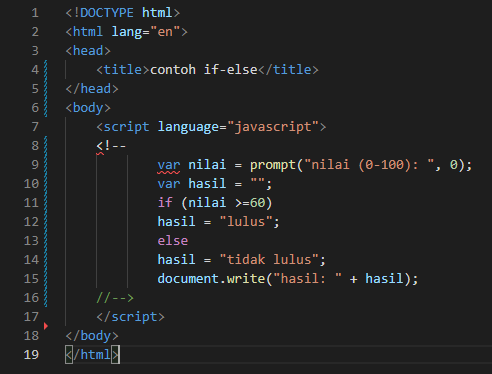

# Lab5Web
| Nama      | Lydia Diffani Siregar |
| ----------- | ----------- |
| NIM     | 312010498       |
| Kelas   | TI.20.A.1        |

## Langkah langkah praktikum 5

1. Pertama - tama membuka VSC

2. Kemudian membuat dokumen HTML dengan nama file <strong> lab4_box.html </strong>

Ini hasil di Microsoft Edge nya

3. <strong> Javascrip Dasar </strong>

 Pemakaian Alert sebagai property window. 

Ini hasil di Microsoft Edge nya

4. Pemakaian method dalam objek

 Ini hasil di Microsoft Edge nya 

5. 
 Pemakaian Prompt 

 Ini hasil di Microsoft Edge nya 

6. 
 Pembuatan fungsi dan cara pemanggilannya 

 Ini hasil di Microsoft Edge nya 

7. <strong> Dasar Pemrograman Di Javascript </strong>

 Operasi dasar aritmatika 

 Ini hasil di Microsoft Edge nya 

Seleksi kondisi (if..else)

 disini saya akan memasukkan data 95 

 Ini hasil di Microsoft Edge nya 

 Penggunaan operator switch untuk seleksi kondisi 

 Ini hasil di Microsoft Edge nya 

8. <strong> Pembuatan Form </strong>

 Form Input 

 Ini hasil di Microsoft Edge nya 

9. 
 Form Button. 

 Ini hasil di Microsoft Edge nya 

10. <strong> HTML DOM </strong>
<strong>
 Pilihan menggunakan checkBox dengan perhitungan otomatis 
</strong>

 Ini hasil di Microsoft Edge nya 

